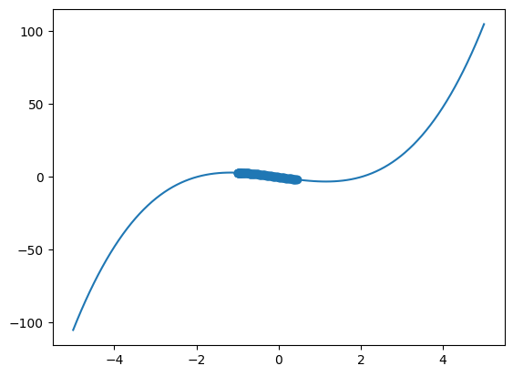

# Gradient Descent
The image below is an example of how Gradient Descent works on a linear equation, whether it is has a negative slope or a positive slope.

## Gradient Descent with a parabola (Equation with a degree of 2)

## Gradient Descent with an equation with a degree of 3.

